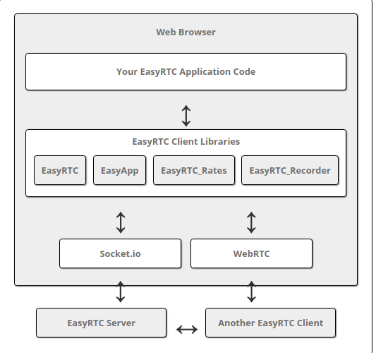

# OMEGLE WebRTC

Este projeto implementa um *chat* *online* similar ao [omegle](https://www.omegle.com/), onde o usuário conversa com pessoas aleatórias via *chat* ou  conferência (audio e video). 


A versão 1 deste projeto, que irá para avaliação do professor, irá implementar a troca de mensagens entre usuários apenas via *chat*. Caso haja tempo hábil, será implementado a video conferência. 

O lado cliente deste projeto será feito em Javascript com os *frameworks* [react](https://github.com/facebook/react) e [easyRTC](https://github.com/priologic/easyrtc).

O lado servidor será implementado em [Node.js](https://nodejs.org/en/), também com o [easyRTC](https://github.com/priologic/easyrtc).


## OMEGLE 1.1

Instalação e utilização:

```
git clone https://github.com/paulosell/SMU29009
cd SMU29009/omegle/front
npm run-script build
cd ../backend
node server.js
```

O projeto irá rodar no *localhost*, porta 8080.

### Sinalização

A sinalização do projeto irá acontecer através da sinalização que o próprio easyrtc provê. A codificação da sinalização é textual e utiliza *websockets* como transporte.

O easyrtc possui três tipos de mensagens:

```
- easyrtcAuth
- easyrtcCmd
- easyrtcMsg
```

----------
#### easyrtcAuth

Esta é a primeira mensagem recebida pelo servidor de sinalização, similar a um REGISTER do protocolo sip. Sem ela, nenhuma outra mensagem é tratada pelo servidor. Após a autenticação, o easyrtc realizada alguns procedimentos em cascata, como criação de sala, troca de informações de ICE servers, etc. De acordo com a documentação do easyrtc, esta mensagem possui os seguintes campos:

**Fields:**

 - **msgData** (required)

**msgData Fields:**

 - **apiVersion** (required) Api version string.
 - **applicationName** (optional) Will default to the server default application.
 - **easyrtcsid** (optional) The EasyRTC session ID which should be available in the browser cookie variables.
 - **username** (optional) String containing the username for the client. May be shared to other clients in the room list.
 - **credential** (optional) Can be any JSONable object.
 - **setUserCfg** (optional) Contains all values from setUserCfg
 - **setPresence** (optional) Contains all values from setPresence
 - **roomJoin** (optional) Contains all values from roomJoin. Will default to application default room.

**Returns:**

 - **token**
 - **error**


----------

#### easyrtcCmd

Este tipo de mensagem é utilizado para enviar e receber comandos do servidor de sinalização do easyrtc. Estes comandos podem ser entrar em uma sala criada, criar uma sala, solicitar e receber configuração de servidores ICE, etc. Logo após a autenticação, o servidor do easyrtc realiza uma série de troca de mensagens do tipo **easyrtcCmd**, sendo elas: roomJoin, token (este sendo resposta da primeira mensagem, autenticação), getIceConfig e setRoomApiField. Os parâmetros de cada requisição e suas respectivas respostas podem ser obtidas em na [documentação oficial](https://github.com/priologic/easyrtc/blob/master/docs/easyrtc_server_msgtypes.md) do easyrtc.

----------


#### easyrtcMsg

Este tipo de mensagem é utilizada a nivel de aplicação (troca de informação entre os pares) no projeto, como em casos onde a criação de um *data channel* entre dois pares é solicitada ou um *ack* é enviado. Possui dois diferentes tipos:

##### General Message Format
Sentido cliente -> servidor

**Fields:**

 - **msgType** (required) - String containing the message type.
 - **msgData** (optional) - Can contain any JSON compatible object or primitive type.
 - **targetEasyrtcid** (optional) - If present, will attempt to forward the message to the specific easyrtcid.
 - **targetGroup** (optional) - If present, will attempt to forward the message to all clients in a specific group. Can work in conjunction with targetEasyrtcid and targetRoom to further restrict the recipient.
 - **targetRoom** (optional) - If present, will attempt to forward the message to all clients in a specific room. Can work in conjunction with targetEasyrtcid and targetGroup to further restrict the recipient.

**Returns:**

 - **ack**
 - **error**

##### General Message Format
Sentido servidor -> cliente

**Fields:**

 - **msgType** (required) - String containing the message type.
 - **msgData** (optional) - Can contain any JSON compatible object or primitive type.
 - **senderEasyrtcid** (optional) - If present, indicates the message was sent by a specific user.
 - **targetEasyrtcid** (optional) - If present, indicates the message was intended only for this specific easyrtcid.
 - **targetGroup** (optional) - If present, indicates the message was intended only for clients in this specific group. Can work in conjunction with targetEasyrtcid and targetRoom to further restrict the recipient.
 - **targetRoom** (optional) - If present, indicates the message was intended only for clients in this specific room. Can work in conjunction with targetEasyrtcid and targetGroup to further restrict the recipient.

**Returns:**

 - **ack**

### Considerações

O servidor de sinalização do easyrtc será utilizado para que os usuários se "registrem" em uma sala. A partir dos usuários conectados na sala, serão abertos *data channels* individuais, onde cada usuário se conectará com outro de cada vez, podendo então acontecer a troca de mensagem entre os dois pares através do *data channel* sobre webRTC. A figura abaixo, retirada da documentação do easyrtc, ilustra a separação e comunicação da aplicação com o servidor de sinalização (através de websockets) e com outra aplicação (através de sobre webRTC).



#### Resumo básico

**Comunicação entre cliente e servidor:** registro no servidor, acesso à salas, configuração STUN/TURN/ICE, solicitação de abertura de *data channels*.

**Comunicação entre os pares:** via *data channels* (webRTC). Troca de mensagens simples via texto (chat).