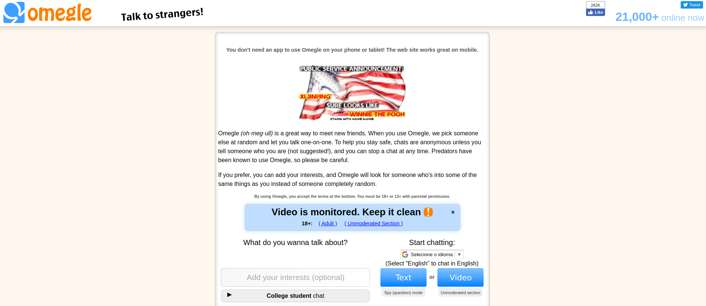

# OMEGLE WebRTC

Este projeto implementa um *chat* *online* similar ao [omegle](https://www.omegle.com/), onde o usuário conversa com pessoas aleatórias via *chat* ou  conferência (audio e video). 



A versão 1 deste projeto, que irá para avaliação do professor, irá implementar a troca de mensagens entre usuários apenas via *chat*. Caso haja tempo hábil, será implementado a video conferência. 

O lado cliente deste projeto será feito em Javascript com os *frameworks* [react](https://github.com/facebook/react) e [easyRTC](https://github.com/priologic/easyrtc).

O lado servidor será implementado em [Node.js](https://nodejs.org/en/), também com o [easyRTC](https://github.com/priologic/easyrtc).


## OMEGLE 1.1

Instalação e utilização:

```
git clone https://github.com/paulosell/SMU29009
cd SMU29009/omegle/front
npm run-script build
cd ../backend
node server.js
```

O projeto irá rodar no *localhost*, porta 8080.

### Oferta de mídia

No momento em que um *peer* deseja abrir um *data channel*, o mesmo envia uma oferta de mídia através do servidor de sinalização para o outro *peer*. Desta forma, o protocolo SDP é enviado encapsulado dentro das mensagens
do *easyrtc*. O bloco abaixo demonstra uma captura através do *wireshark* da oferta de mídia do protocolo SDP.

```
type:offer,
sdp:
v=0
o=- 5992877891373361706 2 IN IP4 127.0.0.1
s=-
t=0 0
m=application 9 UDP/DTLS/SCTP webrtc-datachannel
c=IN IP4 0.0.0.0
a=ice-ufrag:scU4
a=ice-pwd:ngJgjaG93nDvohh77w0yYz1C
a=ice-options:trickle
a=fingerprint:sha-256 91:FC:2E:7D:27:34:BE:5C:4B:4A:C8:69:9F:E1:C4:E3:3C:D2:61:29:A2:73:D3:B0:B6:EC:FD:5E:78:5E:73:CD
a=setup:actpass
a=mid:2
a=sctp-port:5000
a=max-message-size:262144
```

```
type:answer,
sdp:
v=0
o=- 7325903949036046769 2 IN IP4 127.0.0.1
s=-
t=0 0
m=application 9 UDP/DTLS/SCTP webrtc-datachannel
c=IN IP4 0.0.0.0
b=AS:30
a=ice-ufrag:UHTm
a=ice-pwd:mYUPn7bohU8HrgrPaAbWFGvW
a=ice-options:trickle
a=fingerprint:sha-256 E2:CF:A6:A7:0A:7F:3E:34:0A:4B:78:B4:64:FF:10:25:55:47:25:2E:F9:3E:24:DF:5F:25:1A:65:DC:1E:CB:68
a=setup:active
a=mid:2
a=sctp-port:5000
a=max-message-size:262144
```

Como  é possível observar, o campo *m* indica o tipo de dado que está sendo ofertado, neste caso um *data channel* que será aberto. Na oferta, o campo *a=setup:actpass* indica que o *peer* está aberto para envio ou recebimento de dados. Já na resposta, o campo *a=setup:active* indica que o segundo *peer* está aceitando a oferta iniciará uma conexão.


Ocorre também uma troca de menasgens do tipo *candidate*, a qual os *peers* informam um ao outro quais caminhos (ip/porta) eles estão esperando comunicação. O bloco abaixo demonstra as mensagens trocadas.

```
[
"easyrtcCmd",
{   "senderEasyrtcid":"phAr0HHZpDvhSpw8",
    "msgData":
    { 
      "type":"candidate",
      "label":0,
      "id":"0",
      "candidate":"candidate:3772974143 1 udp 2113937151 191.36.10.246 54235 typ host generation 0 ufrag UHTm network-cost 999"
    },
    "easyrtcid":"5VShEhAy794WLU7T",
    "msgType":"candidate",
    "serverTime":1575996038005
}
]


[
"easyrtcCmd",
{ 
  "senderEasyrtcid":"phAr0HHZpDvhSpw8",
  "msgData":
  {
    "type":"candidate",
    "label":0,
    "id":"0",
    "candidate":"candidate:2674381286 1 udp 2113939711 2804:1454:1004:530:6c5e:feab:4603:b29d 43188 typ host generation 0 ufrag UHTm network-cost 999"
    },
    "easyrtcid":"5VShEhAy794WLU7T",
    "msgType":"candidate",
    "serverTime":1575996038006
}
]


[
"easyrtcCmd",
{
  "senderEasyrtcid":"5VShEhAy794WLU7T",
  "msgData":
  { 
    "type":"candidate",
    "label":0,
    "id":"0",
    "candidate":"candidate:3772974143 1 udp 2113937151 191.36.10.246 43340 typ host generation 0 ufrag scU4 network-cost 999"
   },
  "easyrtcid":"phAr0HHZpDvhSpw8",
  "msgType":"candidate",
  "serverTime":1575996038009
}
]


[
"easyrtcCmd",
{
  "senderEasyrtcid":"5VShEhAy794WLU7T",
  "msgData":
  {
    "type":"candidate",
    "label":0,
    "id":"0",
    "candidate":"candidate:2674381286 1 udp 2113939711 2804:1454:1004:530:6c5e:feab:4603:b29d 57553 typ host generation 0 ufrag scU4 network-cost 999"
   },
  "easyrtcid":"phAr0HHZpDvhSpw8",
  "msgType":"candidate",
  "serverTime":1575996038031
}
]

[
"easyrtcCmd",
{
  "senderEasyrtcid":"5VShEhAy794WLU7T",
  "msgData":
  {
    "type":"candidate",
    "label":1,
    "id":"1",
    "candidate":"candidate:3772974143 1 udp 2113937151 191.36.10.246 48403 typ host generation 0 ufrag scU4 network-cost 999"
   },
  "easyrtcid":"phAr0HHZpDvhSpw8",
  "msgType":"candidate",
  "serverTime":1575996038033
}
]


[
"easyrtcCmd",
{
  "senderEasyrtcid":"5VShEhAy794WLU7T",
  "msgData":
  {
    "type":"candidate",
    "label":1,
    "id":"1",
    "candidate":"candidate:2674381286 1 udp 2113939711 2804:1454:1004:530:6c5e:feab:4603:b29d 40975 typ host generation 0 ufrag scU4 network-cost 999"
   },
   "easyrtcid":"phAr0HHZpDvhSpw8",
   "msgType":"candidate",
   "serverTime":1575996038035
}
]

[
"easyrtcCmd",
{
  "senderEasyrtcid":"5VShEhAy794WLU7T",
  "msgData":
  {
    "type":"candidate",
    "label":2,
    "id":"2",
    "candidate":"candidate:3772974143 1 udp 2113937151 191.36.10.246 44614 typ host generation 0 ufrag scU4 network-cost 999"
  },
  "easyrtcid":"phAr0HHZpDvhSpw8",
  "msgType":"candidate",
  "serverTime":1575996038036
}
]

[
"easyrtcCmd",
{
  "senderEasyrtcid":"5VShEhAy794WLU7T",
  "msgData":
  {
    "type":"candidate",
    "label":2,
    "id":"2",
    "candidate":"candidate:2674381286 1 udp 2113939711 2804:1454:1004:530:6c5e:feab:4603:b29d 35442 typ host generation 0 ufrag scU4 network-cost 999"
   },
   "easyrtcid":"phAr0HHZpDvhSpw8",
   "msgType":"candidate",
   "serverTime":1575996038037
}
]

```

É possível observar que os campos "*candidate*" são alterados em cada mensagem, indicando o par **ip** (que pode ser ipv4 ou ipv6) e **porta** que está disponível. O campo **senderEasyrtcid** indica o *pee*r que está enviando a mensagem e o campo **easyrtcid** indica o *peer* que está recebendo a informação.

Por fim, uma mensagem do tipo "dataChannelPrimed", própria do *easyrtc*, é trocada entre os pares que estão estabelecendo o canal de comunicação.

```
[
"easyrtcMsg",
  {
    "senderEasyrtcid":"wnk0rozRfNtqVgdB",
    "targetEasyrtcid":"KdA6zAd7wgZiFFNK",
    "msgType":"dataChannelPrimed",
    "msgData":"",
    "easyrtcid":"KdA6zAd7wgZiFFNK",
    "serverTime":1575831181732
  }
]

[
"easyrtcMsg",
  { 
    "senderEasyrtcid":"KdA6zAd7wgZiFFNK",
    "targetEasyrtcid":"wnk0rozRfNtqVgdB",
    "msgType":"dataChannelPrimed",
    "msgData":"",
    "easyrtcid":"wnk0rozRfNtqVgdB",
    "serverTime":1575831180778
  }
]
```

Após o recebimento dos ACK's destas mensagens, o *data channel* fica estabelecido e os pares podem trocar mensagens livremente.

